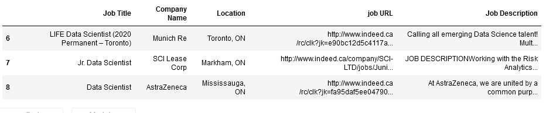
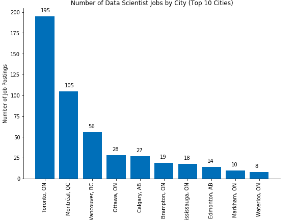

<h1> Creating a Data Frame of Job Postings from Scratch</h1>

I started this project when I was still living in Newfoundland and was working as a Data Scientist at the Center for Health Informatics and Analytics (CHIA). After a while I decided to move to another city and was curious to see how the job market is for Data Scientists in other cities. At first it was obvious that Toronto would have the highest number of job postings for data scientist, but I was also thinking that if you consider the high population of Toronto, then would you still say that if you move to Toronto you would have a higher chance of getting hired? In fact, <b>this is the question we are going to answer in this project.</b>  
This is what we are going to see in this project, but it is not the only thing we will do in this project.
So for this project, the first an the most important thing we need is data, but how we are going to get this data? I wasn't able to find any open data online, so I decided to create my own data set from scratch. This is what we would also do in this project.

<b>Here we are going to create our own data set from real data. </b> 
In fact, this article would also help you if you are a data scientist and want to work with some real data, so you can create your own data set of job postings.
Here we will show how you can scrape the Internet to extract data and create your own real-life data set. The website that we are going to scrape is www.indeed.ca in order to extract job postings data. 
We will get the job titles, company name, location, job posting URL, and more importantly, the job description. 
For this purpose.  

In this notebook we will use: 

<b>BeautifulSoup</b> is a python library that lets you extract information from html and xml files. To see the documentation, pleae click <a href='https://www.crummy.com/software/BeautifulSoup/bs4/doc/'> here</a> 

<b>Pandas</b> for creating a data frame of the job postings data, and also for some data analysis  
<b>Matplotlib</b> for the visualization. We will create some basic graphs in the end. If you are not already familiar with Matplotlib please click <a href='https://matplotlib.org/'> here</a>   
We will use the BeautifulSoup python library for the scraping part, and after we have the data set ready, we will do some data visualizations with Matplotlib.  

<b>Your questions and comments are welcome!  </b>

  This is how the data frame will look like after we scrape the data:

  And this is a basic chart from the data showing the number of Data Science jobs by city.

<h3>We will do this in five steps: </h3>
<ul>
<li> Importing the libraries 
<li> Creating a URL (a string) to brings us to the job posting site with the searching element we have defined 
<li> Getting the number of jobs that are found as our search result. We need this to loop over each and every job posting's URL, and then get the information. We need to know how many jobs and how many pages we are going to scrape 
<li> Extracting job postings information from the url and having them as a data frame 
<li> Saving the data into a CSV file 
<li> Doing some data cleansing
<li> Visualization of the distribution of the jobs by Canadian cities
    
</ul>

### We have done some Natural Language Processing and some more data analysis using this data set. If you are interested, please  <a href='https://www.crummy.com/software/BeautifulSoup/bs4/doc/'> take a look</a> 
