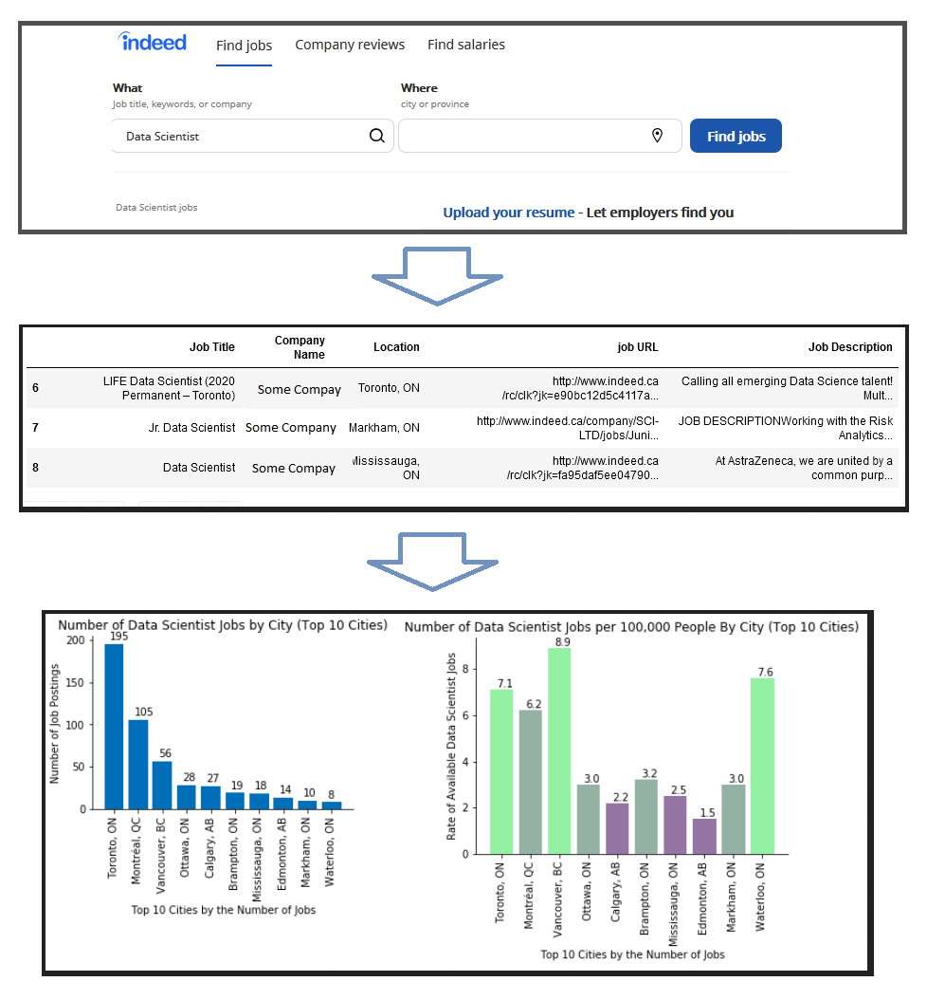
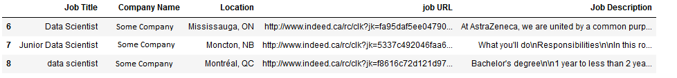
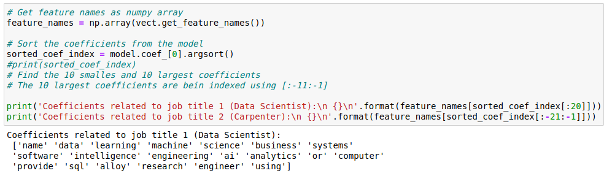
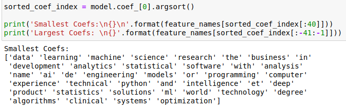
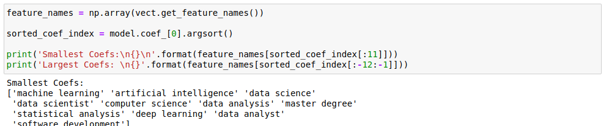
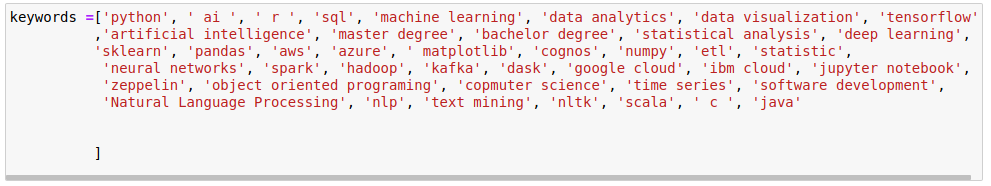
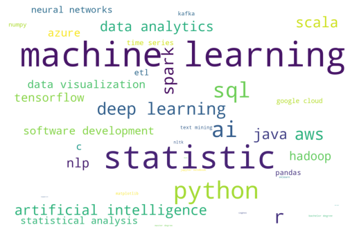
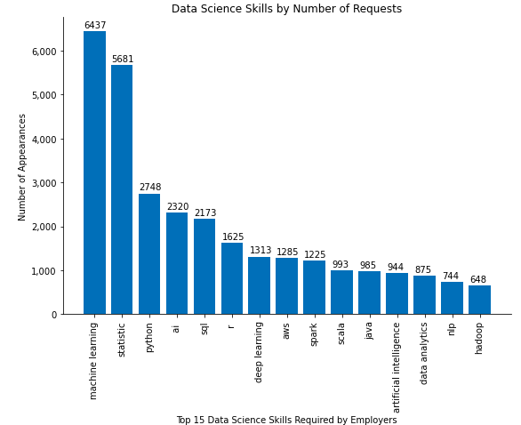
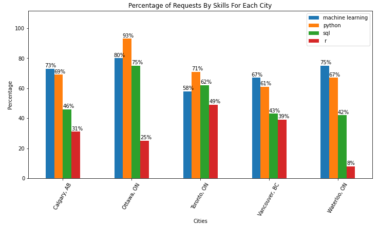

As a Data Scientist, in what Canadian city you will have the highest chance to get hired?
-----------------------------------------------------------------------------------------

This is one type of question that we will be able to answer after creating and analyzing this data set. I started this project when I was still living in Newfoundland and was working as a Data Scientist at the Center for Health Informatics and Analytics (CHIA). After a while I decided to move to another city and was curious to see how the job market is for Data Scientists in other cities. At first it was obvious that Toronto would have the highest number of **job postings** for data scientist, but I was also thinking that if you consider the high population of Toronto, then would you still say that if you move to Toronto, you will still have the highest chance of getting hired? In this project we will show that although Toronto has the highest number of Data Science jobs, you will have a higher chance in Vancouver and Waterloo/kitchener to get hired, rather than Toronto.
(The first screenshot below is taken from indeed.ca)

The diagram below shows the workflow of the project. This application would use indeed.ca to extract job postings data and put them into a Pandas data frame (second step), and once we have the data in data frame format, we can start cleaning and transforming this data, also joining it with other data sets, and finally to visualize the findings from data using Matplotlib (third step). Please note that if you extract too much data, say over 10 GB, you may have to consider using Spark, or cloud computing such as AWS EMR where you get to run your application in parallel using multiple servers.

This is what we are going to see in this project, but it is not the only thing we will do in this project. So for this project, the first an the most important thing we need is data, but how we are going to get this data? I wasn't able to find any open data online, so I decided to create my own data set from scratch. This is what we would also do in this project.

**Here we are going to create our own data set from real data. **
In fact, this article would also help you if you are a data scientist and want to work with some real data, so you can create your own data set of job postings. Here we will show how you can scrape the Internet to extract data and create your own real-life data set. The website that we are going to scrape is [www.indeed.ca](http://www.indeed.ca/) in order to extract job postings data.
We will get the job titles, company name, location, job posting URL, and more importantly, the job description.
For this purpose.

In this notebook we will use:

**BeautifulSoup** is a python library that lets you extract information from html and xml files. To see the documentation, pleae click [here](https://www.crummy.com/software/BeautifulSoup/bs4/doc/)

**Pandas** for creating a data frame of the job postings data, and also for some data analysis
**Matplotlib** for the visualization. We will create some basic graphs in the end. If you are not already familiar with Matplotlib please click [here](https://matplotlib.org/)
We will use the BeautifulSoup python library for the scraping part, and after we have the data set ready, we will do some data visualizations with Matplotlib.

Your questions and comments are welcome!

This is how the data frame will look like after we scrape the data:

### These are the steps we take for this project:

-   Importing the libraries
-   Creating a URL (a string) to brings us to the job posting site with the searching element we have defined
-   Getting the number of jobs that are found as our search result. We need this to loop over each and every job posting's URL, and then get the information. We need to know how many jobs and how many pages we are going to scrape
-   Extracting job postings information from the url and having them as a data frame
-   Saving the data into a CSV file
-   Doing some data cleansing
-   Doing a group\_by to get the number of jobs by location
-   Visualization of the distribution of the jobs by Canadian cities
-   Merging the results with the population data set
-   Calcualting rates of available jobs by 100,000 people
-   Visualization of the results

Second Part:

In this part, we are going to answer these questions:

1. What are the most wanted data science skills in the overal job market?

2. What are the most wanted data science skills by city?

3. Based on your skills, in which Canadian cities you will have the highest chance of getting hired?

4. Recommending most suitable jobs to the user based on their skillset. (in-progress)

In this part, we will use a data set of job postings that we created using the previous part. The data set includes job postings data for 5 different job titles including Data Science, Carpenter, Registered Nurse, and Customer Service Representative.

Steps we took to answer question 1:

1. Taking Data Science jobs as well as one other job title (we chose carpenter in this case)

2. Making the data set balanced by up-sampling in order to get better results in training a Machine Learning model.

3. Using Bag of Word approach for feature detection from our textual data (CountVectorizer)

CountVectorizer creates a sparse matrix with the rows being equal to the number of jobs, and the columns being the words that appear in the whole data set (corpus). The values of this matrix would be the number of times each word appear in the document (job posting)

4. Fitting the CountVectorizer to the training data.

5. Training a Logistic Regression on the vectorized data to find the most important words from the data set specific to each job title:

As you can see, the model was able to detect words such as sql, analytics, machine, learning, AI, intelligence etc.

But we can still improve these results by using TFIDF method.

Using TFIDF:

Tfidf means Term Frequency Inverse Document Frequency. This is a method that gives a weight to each word, and the words that appear only in specific documents but don’t appear in the other documents will get a high weight, but the words that eighted appear in long documents, or appear in both documents will get a low weight.

For example word “jon” will get a really low weight because it appears in both Carpenter and Data Science job description, but a word like “Python” will get a high weight because it only appears in Data Scientist jobs and does not appear in Carpenter jobs.

In the screenshot above, you can see that the model was able to detect more important words such as “python”. This shows that using TFIDF improved our results. But still the model is seeing Machine and Learning as two separate words. To fix this issue we used n-grams method in which you make the model able to get the words that are colocated as one whole word.

Now you can see that the result was improved and now we have “Artifical Intelligence”, “Data Analysis”, and “Master Degree” also detected as important words in the Data Science jobs.

So the model was able to detect a lot of the important skills in Data Science industry, but to be able to get better results, we manually added some more skills to the list, such as AWS and Azure that the model was not able to detect.

Now that we know what keywords we should look for in the job postings data, we created a word cloud to show what skills are more important the others:

Now the word cloud shows how Machine Learning and Statistics are the most important skills in Data Science, and also how Python is more popular compared to R. You can also see how AWS is winning over Azure in the job market.

But is this going be the same in each city? Let’s see..

We took 4 of these skills as examples and looked into the number of jobs in each city that are asking for this skill and the result was as follows:

As you can see, employers in different cities have different desire for each one of these skills.

For example, if you are really good in Python, then Toronto and Ottawa would be good places for you, at the same time, if you are using R for your work, then you would have a really low chance getting hired in Waterloo.
